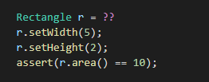
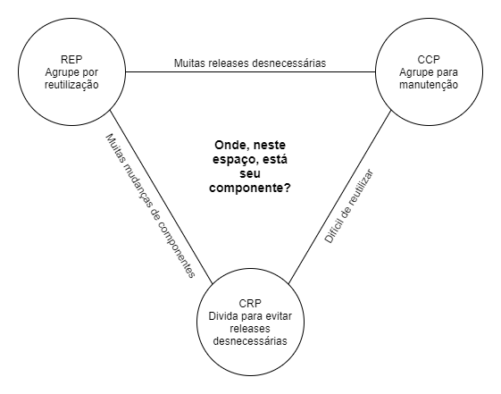
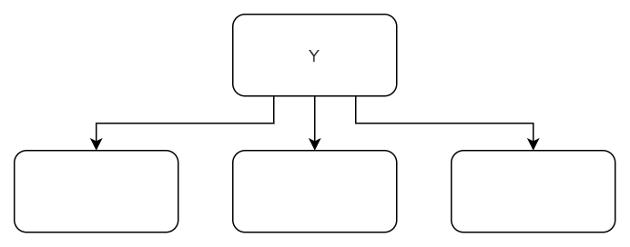
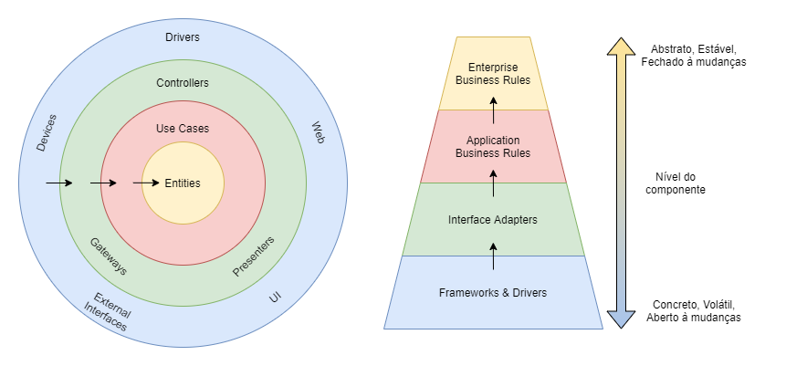
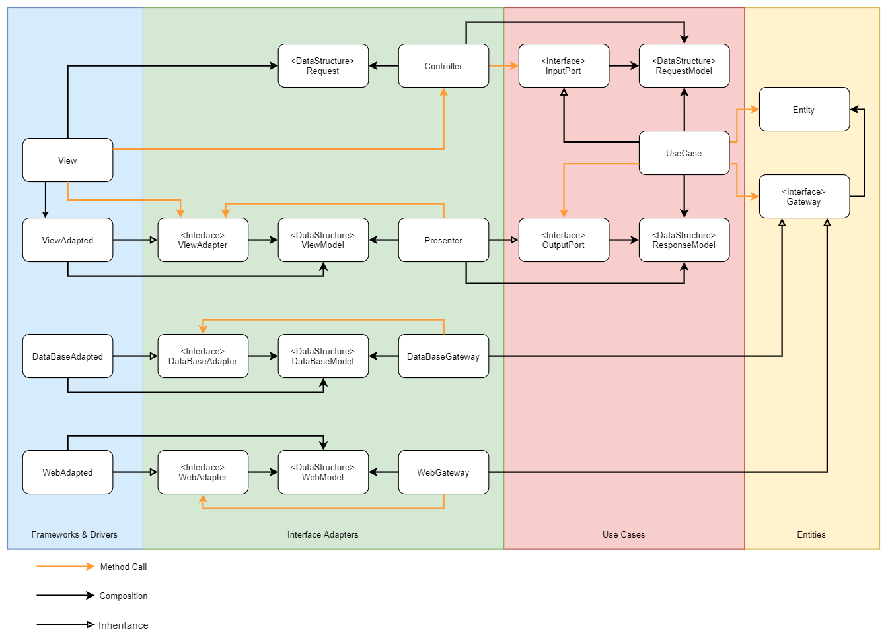

# Arquitetura Limpa
## SOLID

### Princípio da Inversão de Dependência (DIP)

O Princípio da Inversão de Dependência diz que **“os sistemas mais flexíveis são aqueles em que as dependências de código-fonte se referem apenas a abstrações e não a itens concretos”**. De forma mais precisa, não queremos depender de itens concretos e voláteis dos _nossos_ sistemas. Implementações concretas como a classe String, por exemplo, não são um problema, já que elas dificilmente vão mudar.
Elementos de níveis mais altos, mais próximos à regra de negócio (o que chamaremos de Entidades), devem ser mais estáveis e mais abstratos. Garantimos isso aplicando o Princípio da Inversão de Dependência.
Para aplicar a inversão de dependência, cria-se uma abstração para definir um contrato, que deverá ser implementado por uma camada de nível mais baixo. Dessa forma, a seta de dependência inverte sua direção.

### Princípio da Responsabilidade Única (SRP)

O Princípio da Responsabilidade Única diz que **“um módulo só deve ter uma, e apenas uma, razão para mudar”**. Mas essa definição, segundo o livro, na verdade cabe apenas às funções/métodos.
Um software existe para atender as demandas de usuários ou stakeholders, que podem fazer parte de grupos conhecidos pela definição de negócio (ex: usuário comum ou admin, CTO ou CEO). Cada grupo desse pode ser referido com um Ator. Ou seja, o código fonte do sistema deve ser separado e agrupado baseando-se em cada ator que utiliza o sistema. Dessa forma, a definição correta do SRP é:

**“Um módulo deve ser responsável por um, e apenas um, ator”.**

### Princípio da segregação de interfaces (ISP)

O Princípio de Segregação de Interfaces busca orientar o desenvolvimento de forma que um código não dependa de coisas que não irá utilizar, poupando assim, uma compilação e implantação desnecessárias. Porém, além desses detalhes de baixo nível por trás do ISP, podemos utilizá-lo em níveis arquiteturais junto com SRP para criar artefatos mais coesos, reutilizáveis e independentes.

### Princípio da substituição de Liskov (LSP)

O Princípio da Substituição de Liskov diz que **“se, para cada objeto o1 do tipo S existir um objeto o2 do tipo T, de modo que todo programa P definido em termos de T, o comportamento de P é inalterado quando o1 é substituído por o2, então S é um subtipo de T.”**

Esse princípio é sobre heranças. É um guia para garantir que os subtipos possam ser substituídos com segurança, sem alterar o comportamento do programa. E para garantir isso, é necessário conhecer como o sistema deve funcionar, sobre o negócio, para se realizar code review e criar testes efetivos.

**O problema do quadrado/retângulo**

Um quadrado (Square) não é uma extensão válida de um retângulo (Rectangle). Isso porque a área dos quadrados é definida em função de um único valor: o tamanho de qualquer um de seus lados. Em contrapartida, um retângulo tem sua área definida em função de dois valores: largura e altura. Portanto, dado o diagrama acima, o código a seguir não funcionaria, caso a instância passada para a variável “r” fosse um Square:

### Princípio do aberto fechado (OCP)

O Princípio Aberto Fechado diz que **“Um artefato de software deve ser aberto para extensão, mas fechado para modificação”**. Esse princípio é muito bem aplicado à classes e módulos, mas também tem muita importância no nível de componentes arquiteturais. “Uma boa arquitetura de software deve reduzir a quantidade de código a ser mudado para o mínimo possível. Zero seria o ideal”.

Este princípio é o mais dependente dos outros, quase uma consequência. Principalmente do Princípio da Responsabilidade Única e do Princípio da Inversão de Dependências, que, quando aplicados, separam as responsabilidades em artefatos coesos e protege artefatos de níveis mais altos dos artefatos de níveis mais baixos, respectivamente. Portanto, os artefatos de níveis mais altos são os mais fechados à mudanças e abertos a extensões.

## COMPONENTES

Componentes são as menores unidades implantáveis que formam um sistema; um jar, uma dll. Acredito que alguns princípios de componentes possam ser bem aplicados em arquitetura de micro serviços. Sendo cara micro serviço um componente.

### Coesão de componentes

### Princípio da equivalência do reúso/release (REP)

**“A granularidade do reúso é a granularidade do release”**

Isso significa que “classes e módulos formados em um componente devem pertencer a um grupo coeso”. Ou seja, um componente é constituído por classes e módulos “próximos” e que, portanto, tendem a ser utilizados juntos. Ou seja, agrupamento por reúso.

### Princípio do fechamento comum (CCP)

**“Reúna em componentes as classes que mudam pelas mesmas razões e nos mesmos momentos. Separe em componentes diferentes as classes que mudam em momentos diferentes e por diferentes razões”**

Se um conjunto de classes são fisicamente ou conceitualmente ligadas e sempre mudam juntas, então essas classes estão dentro de um mesmo componente. Ou seja, o objetivo desse princípio é manter alterações no escopo de um componente.

### Princípio do reúso comum (CRP)

**“Não force os usuários de um componente a dependerem de coisas que não precisam”**

Esse princípio ajuda a definir quais classes e módulos não farão parte do mesmo componente, de forma que fique apenas classes e módulos que são inseparáveis, onde quem depende do componente, depende de tudo dentro dele.

### Diagrama de tensão para coesão de componentes

Esses três princípios tendem a lutar uns com os outros. “O REP e o CCP são princípios inclusivos: ambos tendem a aumentar os componentes. Por sua vez, o CRP é um princípio excludente e diminui os componentes”.

O diagrama de tensão de componentes, mostra como cada princípio interage entre si. As bordas representam o custo ao abandonar o princípio do vértice oposto.

## Acoplamento de componentes

### O Princípio das dependências acíclicas

**“Não permita ciclos no grafo de dependência dos componentes”**

A “síndrome da manhã seguinte” é o efeito colateral da quebra deste princípio: ao final do dia, um desenvolvedor termina seu trabalho com tudo funcionando. No dia seguinte, o código está quebrado, porque alguém mudou um código do qual ele dependia.

Para quebrar esse ciclo, usa-se inversão de dependências, fazendo com que as setas de dependências apontem todas para a mesma direção.

### O Princípio de dependências estáveis

**“Dependa na direção da estabilidade”**

Se um componente não tem dependências, porém é dependência de outros componentes, então esse componente é independente e responsável. Portanto, esse componente é estável e difícil de mudar.

Por outro lado, caso um componente tenha dependências de outros componentes, mas ninguém depende dele, então ele é dependente e irresponsável. Logo, esse componente é volátil e fácil de mudar.

Dessa forma, componentes mais voláteis devem depender de componentes mais estáveis. Note que um componente tem um grau de estabilidade.

### O Princípio de abstrações estáveis

**“Um componente deve ser tão abstrato quanto estável”**

Esse princípio é um complemento do anterior. Ele especifica quais componentes devem ser estáveis. “Um componente estável também deve ser abstrato, para que essa estabilidade não impeça sua extenção”. Ou seja, esse princípio se apoia no OCP, que diz que os artefatos de níveis mais altos são os mais fechados à mudanças e mais abertos a extensões. Esses artefatos, portanto, são abstratos.

## ARQUITETURA LIMPA

A arquitetura limpa, criada por Robert Martin, é baseada na arquitetura hexagonal, na arquitetura DCI (Data, Context and Interaction), BCE (Entity, Control and Boundary) e tem sua base fundada nos princípios SOLID e na "regra da dependência". Sendo complementada pelos princípios de componentes.

### A Regra da dependência

**“As dependências de código-fonte devem apontar apenas para dentro, na direção das políticas de nível mais alto”**

Logo, a parte mais externa do diagrama circular (políticas de níveis mais baixos) é mais volátil e concreta; em contrapartida, a parte mais interna (política de níveis mais alta) é a mais estável e abstrata. Essa regra é uma reafirmação ao Princípio do Aberto Fechado e ao Princípio das Abstrações Estáveis. Note como as setas sempre apontam para dentro, nunca para fora do círculo.

### Entidades (Regras de negócio da empresa)

Entidade é todo código que reúne as Regras Cruciais de Negócio da empresa, as políticas de alto nível. Não importa se é uma classe com métodos, uma estrutura de dados, interfaces, etc. Elas também são as mais abstratas e abertas à extensão. Portanto, podem ser reutilizáveis em várias aplicações diferentes da empresa.

### Caso de uso (Regras de negócio da aplicação)

Um caso de uso é a descrição da maneira de como um sistema automatizado é usado. Ele especifica a entrada a ser fornecida pelo Ator, a saída a ser retornada para esse Ator e os passos de processamento das entidades envolvidas na produção dessa saída. Ou seja, o caso de uso orquestra as entidades para atender, de forma automatizada, as necessidades de um Ator.

### Adaptadores de Interface

Os códigos dessa camada são responsáveis por converter os dados vindos de algum agente externo em dados no formato mais conveniente para os casos de uso. Também são responsáveis por converter os dados de saída de um caso de uso, para um formato mais conveniente para o agente externo (ex: banco de dados).

### Frameworks e Drivers

Nessa camada é realizada as conexões com frameworks e drivers. É onde ficam todos os detalhes: web, base de dados, serviços externos, etc. Essa é a camada mais concreta do modelo.

## Um cenário típico

Esse diagrama é baseado nos diagramas apresentados no livro nas páginas 208 e 72.

Primeiro, a *View* realiza uma *Request* para um *Controller*, que monta o *Request Model* e passa o mesmo para o *Use Case*, através da sua interface de entrada *InputPort,* que orquestra as *Entities*. Ao final, realiza uma chamada ao *OutputPort,* cujo a implementação é o *Presenter*, responsável por montar o *Response Model* e repassá-lo para a *View.*

Note que a implementação de *SomeGateway*, que é uma *Entity*, está na camada de Interface Adapters. Nesse ponto foi realizada uma inversão de dependência para não quebrar a regra da dependência. Ao mesmo passo, ganha-se extensibilidade, visto que pode haver mais de uma implementação para *SomeGatway*. Assim fica fácil trocar a busca de um dado em um banco de dados por uma busca a um outro serviço web, por exemplo. Portanto, todas as dependências sempre apontam para uma camada com uma política de nível maior.

Como cada caso de uso é responsável por um ator, logo, toda essa estrutura é feita para uma funcionalidade que esse ator poderá interagir.

## Conclusão

A Arquitetura Limpa é um modelo de arquitetura, que surge naturalmente da aplicação dos princípios SOLID e da regra da dependência. E é complementada com os princípios de Componentes. Seu objetivo é propor um modelo de referência de como criar aplicações independentes de frameworks, UI, banco de dados e qualquer agência externa. Por ser independente, se torna fácil e barata de se testar. Garante extensibilidade e protege as políticas de alto nível, tornando-as mais estáveis.

## REFERÊNCIAS

### Robert C. Martin - Arquitetura Limpa (Livro)

[Full Cycle - Clean Architecture](https://youtu.be/BuSf7VsH064)

[Como DEV ser! - Entenda CLEAN ARCHITECTURE de uma vez por todas! 🧻 | Como DEV ser!](https://youtu.be/HynTfTli4mw)

[Otavio Lemos - 45 - Clean Architecture](https://youtu.be/ONj4zvLtmpA)

[Full Cycle - Arquitetura Hexagonal: O que você precisa saber](https://youtu.be/or5zAOASPjU)

[Spring I/O - Clean Architecture with Spring by Tom Hombergs @ Spring I/O 2019](https://youtu.be/cPH5AiqLQTo)

[UnityCoin - Clean Code - Uncle Bob / Lesson 1](https://youtu.be/7EmboKQH8lM)

[UnityCoin - Clean Code - Uncle Bob / Lesson 2](https://youtu.be/2a_ytyt9sf8)

[UnityCoin - Clean Code - Uncle Bob / Lesson 3](https://youtu.be/Qjywrq2gM8o)

[UnityCoin - Clean Code - Uncle Bob / Lesson 4](https://youtu.be/58jGpV2Cg50)

[UnityCoin - Clean Code - Uncle Bob / Lesson 5](https://youtu.be/sn0aFEMVTpA)

[UnityCoin - Clean Code - Uncle Bob / Lesson 6](https://youtu.be/l-gF0vDhJVI)

[André Secco  - Componentes da Clean Architecture](https://www.youtube.com/playlist?list=PL3thWewfjbFS2_Mf9730Aucn5BUOa3qFu)

[Michelli Brito - ARQUITETURA HEXAGONAL EM MICROSERVICES NA PRÁTICA PARTE 1](https://youtu.be/UmdOjbyYOX0)

[Michelli Brito - https://youtu.be/rpCXNOEMVXk](https://youtu.be/rpCXNOEMVXk)
